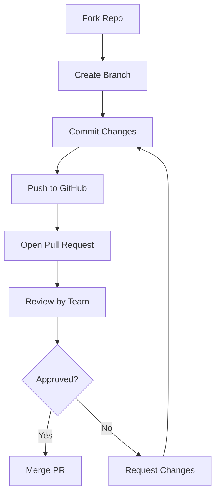

Here’s a beginner-friendly `.md` guide to **Pull Requests (PRs)** on GitHub:

---

# 🔃 GitHub Pull Requests Guide

A **Pull Request (PR)** is how you propose changes to someone else's GitHub repository or even your own. It allows others to review, comment, and merge your changes into the main codebase.

---

## 🧑‍💻 When to Use a Pull Request?

- When you contribute to **open-source projects**
- When you work in a **team on a shared repo**
- When you want others to **review your code** before merging

---

## 🪜 How to Create a Pull Request?

### 1. ✅ Fork the Repo (If you don't own it)
- Click the `Fork` button on the top-right of the repo page.
- It creates a copy in your GitHub account.

### 2. ⬇️ Clone Your Forked Repo

```bash
git clone https://github.com/your-username/repo-name.git
cd repo-name
````

### 3. 🔧 Create a New Branch

```bash
git checkout -b my-feature
```

### 4. 🧑‍💻 Make Changes & Commit

```bash
# make your changes
git add .
git commit -m "Add new feature or fix bug"
```

### 5. 🔼 Push Changes

```bash
git push origin my-feature
```

### 6. 🔃 Open a Pull Request

* Go to your forked repo on GitHub
* Click `Compare & pull request`
* Add a title and description
* Click `Create pull request`

---

## 🔍 What Happens Next?

* The repo owner or team will **review** your code.
* They may **request changes**, **approve**, or **merge** it.
* Once merged, your changes are in the main repository.

---

## 🔁 Pull Request Life Cycle



---

## 📝 Best Practices

* Write clear **commit messages**
* Add a meaningful **PR title and description**
* Always use a **separate branch** for each feature or fix
* Link related **issues** (e.g., `Fixes #1`)

---

## 🧠 Tip

You can also create PRs between two branches **within your own repository** (like from `dev` to `main`).

---

```

Let me know if you want this included in your full Git `.md` file, or need a version for **React projects or GitHub Pages** integration with PRs.
```
