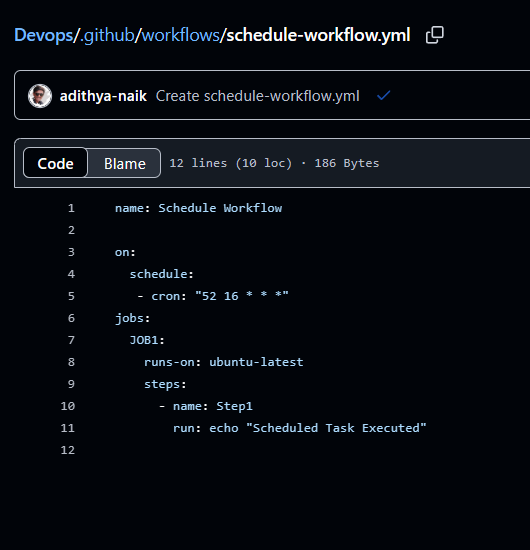

#  How to Schedule GitHub Actions Workflows 
- to execute a particular workflow at a particular time like for generating weekly reports etc...
- CRON - command run on
- it is a time based scheduler
- this follows a format i.e . minute hour date month dayofweek

