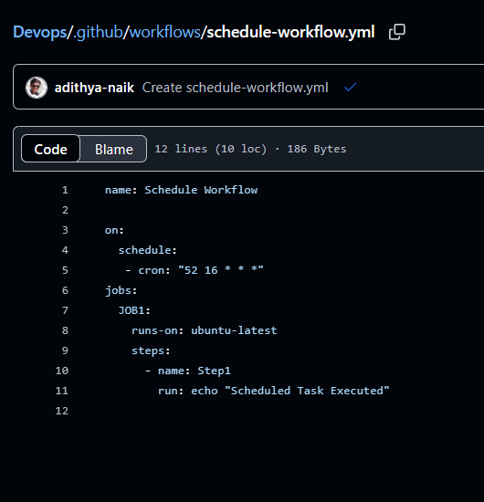

# Git Workflow
- untracked
- tracked
- staged
- commit
## Types of Repo
- local
- global
## Working Directory
- place where we r working
- not yet saved to git's history till we initialize the git repo using `git add .` and `git commit -m "initial commit"`
## Local Repo
- version of code on git  that is saved on our computer
## Remote repo
- version of code on git that is saved on the server

# FLOW :-

# 1
